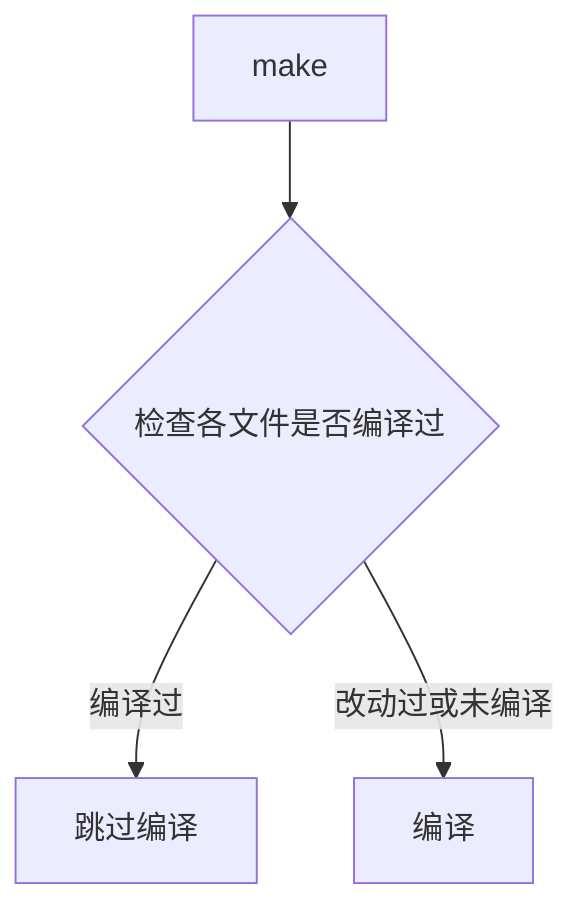

# 程序三步

## 编译为.o/.obj

## 打包为库.a/.lib

## 链接为.exe




# makefile规则：

```makefile
target:prerequisites
	command
#target可以是 目标文件/Object File/Label(伪目标)
#prerequisites依赖项
#command：命令，命令前应有1 tab缩进
```

# makefile变量
## 奇变量

### $@

目标文件

### $^

所有的依赖文件

### $<

第一个依赖文件

# makefile推导

## 隐晦规则

## 伪目标文件

# makefile组成

## 1.显式规则

## 2.隐晦规则

## 3.变量定义

## 4.文件指示

## 5.注释

## Ps

最后，还值得一提的是，在Makefile中的命令，必须要以[Tab]键开始。

## makefile文件名

大多数的make都支持“**makefile”和“Makefile”**这两种默认文件名。


